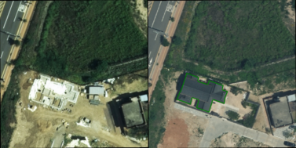
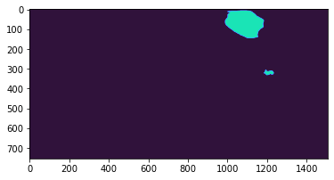
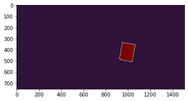

# Military AI CompetitiON (MAICON)

## Building Change Detection Using Aerial Image Data
### 15th 🛰

- **Organiser**: Ministry of National Defense & Ministry of Science and ICT, South Korea
- **Period**: 8th - 14th Nov, 2022

## Abstract
We developed a model for **building change detection**. Using about **10+ remote computers**, we experimented with models using DeeplabV3, DeeplabV3+, Unet, Unet++, FPN, Linknet, MAnet, PSPNet, and PAN as methods and RegNetY008, RegNetY032, and EfficientNetB4 as backbones. We also ventured into models that utilized the Swin Transformer (specifically Swin-L and Swin-T) as backbones with UPerNet methods from [mmsegmentation](https://github.com/open-mmlab/mmsegmentation). To evaluate the models, we relied on mIOU as our metric. Among our models, the model combining the **DeeplabV3** method with the **RegNetY008** backbone emerged as the best performer, boasting an mIOU score of **0.6830**.

## Datasets
We utilised aerial image data of Seoul. The data's labels are encoded as follows: 'Background' (indicating no change) is **0**, 'New' is **1**, 'Destroyed' is **2**, and 'Update' is **3**.

| New | Destroyed | Update |
|:---:|:---:|:---:|
||||

## Results

### [2017_KRG_2LB_000887.png](./assets/2017_KRG_2LB_000887.png)
| Ground-truth (Aerial image) | UperNet(Swin-T) (Aerial image)|  
|:---:|:---:|  
|||   

| Ground-truth (Mask)|UperNet(Swin-T) (Mask) |DeepLabV3(regnety_008) (Mask)|  
|:---:|:---:|:---:|  
||||  

### [2017_MPG_2LB_000631.png](./assets/2017_MPG_2LB_000631.png)
| Ground-truth (Aerial image) | UperNet(Swin-T) (Aerial image)|  
|:---:|:---:| 
|||

| Ground-truth (Mask)|UperNet(Swin-T) (Mask) |DeepLabV3(regnety_008) (Mask)|  
|:---:|:---:|:---:|  
||||    

### [2019_KSG_1JY_000010.png](./assets/2019_KSG_1JY_000010.png)
| Ground-truth (Aerial image) | UperNet(Swin-T) (Aerial image)| 
|:---:|:---:|
|||

|Ground-truth (Mask)|UperNet(Swin-T) (Mask) |DeepLabV3(regnety_008) (Mask)|  
|:---:|:---:|:---:|  
||||  

## Experiments

### CNN
| Method | Backbone | Pretrain | mIoU@1 | mIoU@2| config | log | model |
|:---:|:---:|:---:|---:|:---:|:---:|:---:|:---:|
| DeepLabV3 | regnety_008 | imagenet | 0.5275 | 0.6830 |[config](./trained_models/Best_models/DeepLabV3/20221113_010847(best)(DeepLabV3_regnety008)/train.yaml)|[log](./trained_models/Best_models/DeepLabV3/20221113_010847(best)(DeepLabV3_regnety008)/train.log)|[model](./trained_models/Best_models/DeepLabV3/20221113_010847(best)(DeepLabV3_regnety008)/model.pt)|
| DeepLabV3Plus | efficientnet-b4 | noisy-student | 0.4476 | 0.6220 |[config](./trained_models/trained_models/cnn/trained_models_maicon_codes_computer_room_5/train/DeepLabV3Plus/20221111_015224/train.yaml)|[log](./trained_models/trained_models/cnn/trained_models_maicon_codes_computer_room_5/train/DeepLabV3Plus/20221111_015224/train.log)|[model](./trained_models/trained_models/cnn/trained_models_maicon_codes_computer_room_5/train/DeepLabV3Plus/20221111_015224/model.pt)|
| Unet | efficientnet-b4 | imagenet | 0.3990 | - |[config](./trained_models/trained_models/cnn/trained_models_maicon_codes_computer_room_2/20221109_142314(unet_efficientb4)/train.yaml)|[log](./trained_models/trained_models/cnn/trained_models_maicon_codes_computer_room_2/20221109_142314(unet_efficientb4)/train.log)|[model](./trained_models/trained_models/cnn/trained_models_maicon_codes_computer_room_2/20221109_142314(unet_efficientb4)/model.pt)|
| Unet++ | efficientnet-b4 | noisy-student | 0.3762 | - |[config](./trained_models/trained_models/cnn/trained_models_maicon_codes_computer_room_2/20221109_151114(unet++_efficientb4)/train_copy1.yaml)|[log](./trained_models/trained_models/cnn/trained_models_maicon_codes_computer_room_2/20221109_151114(unet++_efficientb4)/train.log)|[model](./trained_models/trained_models/cnn/trained_models_maicon_codes_computer_room_2/20221109_151114(unet++_efficientb4)/model.pt)|
| UperNet | resnet101 | ade20k | 0.3376 | - |[config](./experiments_ViT/ViT/mmseg/mmsegmentation/configs/upernet/upernet_r101_512x512_160k_ade20k.py/)|[log](./trained_models/trained_models/cnn/upernet_r101_512x512_160k_ade20k/None.log.json)|[model](./trained_models/trained_models/cnn/upernet_r101_512x512_160k_ade20k/iter_780000(latest)_0.3376.pth)|
| Unet | regnety_002 | imagenet | 0.2367 | - |[config](./trained_models/trained_models/cnn/trainded_models_maicon_codes_computer_room_1(close_to_baseline)/train/Unet(regnety_002)/20221109_231024/train.yaml)|[log](./trained_models/trained_models/cnn/trainded_models_maicon_codes_computer_room_1(close_to_baseline)/train/Unet(regnety_002)/20221109_231024/train.log)|[model](./trained_models/trained_models/cnn/trainded_models_maicon_codes_computer_room_1(close_to_baseline)/train/Unet(regnety_002)/20221109_231024/model.pt)|
| Linknet | regnety_008 | imagenet | 0.1641 | - |[config](./trained_models/trained_models/cnn/trainded_models_maicon_codes_computer_room_1(close_to_baseline)/train/Linknet(regnety_008)/20221118_010442/train.yaml)|[log](./trained_models/trained_models/cnn/trainded_models_maicon_codes_computer_room_1(close_to_baseline)/train/Linknet(regnety_008)/20221118_010442/train.log)|[model](./trained_models/trained_models/cnn/trainded_models_maicon_codes_computer_room_1(close_to_baseline)/train/Linknet(regnety_008)/20221118_010442/model.pt)|

<strike>an unoffical thing..b.7</strike>

### Transformer
| Method | Backbone | Pretrain | Crop Size | Lr Schd | mIoU@1 | mIoU@2 | config | log | model |
|:---:|:---:|:---:|:---:|:---:|:---:|:---:|:---:|:---:|:---:|
| UperNet | Swin-T | ade20k | 378x378 | 160k | 0.4110 | 0.4065 |[config](./experiments_ViT/ViT/mmseg/mmsegmentation/configs/swin/upernet_swin_tiny_patch4_window7_512x512_160k_ade20k_pretrain_224x224_1K_MAICON)|[log]([config](./trained_models/Best_models/Transformer/upernet_swin_tiny_patch4_window7_512x512_160k_ade20k_pretrain_224x224_1K_8/None.log.json))|[model]([config](./trained_models/Best_models/Transformer/upernet_swin_tiny_patch4_window7_512x512_160k_ade20k_pretrain_224x224_1K_8/iter_80003_0.411.pth))|
| UperNet | Swin-S | ade20k | 256x256 | 160k | 0.3877 | - |[config](./experiments_ViT/ViT/mmseg/mmsegmentation/configs/swin/upernet_swin_small_patch4_window7_512x512_160k_ade20k_pretrain_224x224_1K.py)|[log](./trained_models/trained_models/transformer/swin_small_patch4_window7_512x512_160k_ade20k_3/None.log_4.json)|[model](./trained_models/trained_models/transformer/swin_small_patch4_window7_512x512_160k_ade20k_3/iter_820000_0.3877.pth)|
| UperNet | Swin-L | ade20k | 256x256 | 160k | 0.3625 | - |[config](./experiments_ViT/ViT/mmseg/mmsegmentation/configs/swin/upernet_swin_large_patch4_window7_512x512_pretrain_224x224_22K_160k_ade20k.py)|[log](./trained_models/trained_models/transformer/upernet_swin_large_patch4_window7_512x512_pretrain_224x224_22K_160k_ade20k/None.log.json)|[model](./trained_models/trained_models/transformer/upernet_swin_large_patch4_window7_512x512_pretrain_224x224_22K_160k_ade20k/iter_970000_0.3625.pth)|

Note: 
- If you want to access config, log, and model in above tables, extract compressed folders in [trained_models](./trained_models/), then you can reach those files.
- Please let me know if you want to obtain things about models. ([Contact](mailto:asdd3525@gmail.com))
- mIOU@1 is the Local loss measured on our computer. 
- mIOU@2 is the Competition loss measured in competition. 

## Summary
The model that combinded **DeepLabV3** method with **RegNetY008** backbone achieved an mIOU score of **0.6830**. As you may already know, models with Transformer backbone are leading the way in many change detection tasks, as you can see [here](https://paperswithcode.com/sota/change-detection-on-dsifn-cd?p=a-transformer-based-siamese-network-for). However, in our specific task, these models were too large to train, so it was not feasible to optimise hyperparameters within the time-limited competition period. Furthermore, our available equipment lacked the capacity to handle the computational demands of these large transformer models, which have a significant number of parameters. Consequently, we used small transformer models during the competition.

After the competition, I conducted additional experiments on transformer models. As a result, I figured out that the input data in this problem has a single-image containing both before and after changes, unlike typical change detection problems where they use two inputs (one for before the change and the other for after the change), and corresponding encoders for training. This type of single-image input data prevents transformer models or any large model from extracting the correct features. Therefore to improve performance using transformer models, it is essential to reconstruct basic models consisting of two encoders for two input data.

## License
This repository is released under the MIT license as found in the [LICENSE](LICENSE) file.
